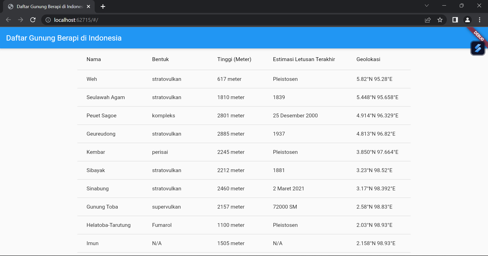

# UAS_Flutter
## Profil
| #               | Biodata                 |
| --------------- | ----------------------- |
| **Nama**        | Nabilah Ananda Putri    |
| **NIM**         | 312110263               |
| **Kelas**       | TI.21.A.1               |
| **Mata Kuliah** | Pemrograman Web 2       |

## Membuat Tampilan List API dengan Menggunakan Flutter

Program ini dibuat untuk menampilkan daftar nama stasiun kereta api di Indonesia dengan mengambil data API yang disediakan oleh PT KAI. Data API bisa dilihat di link berikut [API Gunung Berapi di Indonesia]([https://booking.kai.id/api/stations2](https://indonesia-public-static-api.vercel.app/api/volcanoes)https://indonesia-public-static-api.vercel.app/api/volcanoes). Berikut merupakan source code untuk **main.dart**:

```dart
import 'dart:convert';
import 'package:flutter/material.dart';
import 'package:http/http.dart' as http;

void main() {
  runApp(MyApp());
}

class MyApp extends StatelessWidget {
  @override
  Widget build(BuildContext context) {
    return MaterialApp(
      title: 'Daftar Gunung Berapi di Indonesia',
      theme: ThemeData(
        primarySwatch: Colors.blue,
      ),
      home: MyHomePage(title: 'Daftar Gunung Berapi di Indonesia'),
    );
  }
}

class MyHomePage extends StatefulWidget {
  MyHomePage({Key? key, required this.title}) : super(key: key);

  final String title;

  @override
  _MyHomePageState createState() => _MyHomePageState();
}

class _MyHomePageState extends State<MyHomePage> {
  late Future<List<dynamic>> _volcanoes;

  Future<List<dynamic>> fetchVolcanoes() async {
    final response = await http.get(Uri.parse(
        'https://indonesia-public-static-api.vercel.app/api/volcanoes'));
    if (response.statusCode == 200) {
      return json.decode(response.body);
    } else {
      throw Exception('Failed to load data');
    }
  }

  @override
  void initState() {
    super.initState();
    _volcanoes = fetchVolcanoes();
  }

  @override
  Widget build(BuildContext context) {
    return Scaffold(
      appBar: AppBar(
        title: Text(widget.title),
      ),
      body: Center(
        child: FutureBuilder<List<dynamic>>(
          future: _volcanoes,
          builder: (context, snapshot) {
            if (snapshot.hasData) {
              List<dynamic> data = snapshot.data!;
              return SingleChildScrollView(
                child: DataTable(
                  columns: [
                    DataColumn(label: Text('Nama')),
                    DataColumn(label: Text('Bentuk')),
                    DataColumn(label: Text('Tinggi (Meter)')),
                    DataColumn(label: Text('Estimasi Letusan Terakhir')),
                    DataColumn(label: Text('Geolokasi')),
                  ],
                  rows: data
                      .map((item) => DataRow(cells: [
                            DataCell(Text(item['nama'].toString())),
                            DataCell(Text(item['bentuk'].toString())),
                            DataCell(Text(item['tinggi_meter'].toString())),
                            DataCell(Text(
                                item['estimasi_letusan_terakhir'].toString())),
                            DataCell(Text(item['geolokasi'].toString())),
                          ]))
                      .toList(),
                ),
              );
            } else if (snapshot.hasError) {
              return Text("${snapshot.error}");
            }
            return CircularProgressIndicator();
          },
        ),
      ),
    );
  }
}
```

* Menggunakan `package http` untuk melakukan permintaan HTTP GET ke API yang diberikan.
  
* Menggunakan `FutureBuilder` untuk menampilkan loading spinner saat data sedang dimuat dan menampilkan tabel setelah data selesai dimuat.
  
* Data diubah menjadi tipe `List<dynamic>` dan ditampilkan dalam `DataTable` dengan tiga kolom: Nama, Bentuk, Tinggi(Meter), Estimasi Letusan Terakhir, dan Geolokasi.

* Setelah membuat source code pada **main.dart**, lalu tambahkan package http pada **pubspec.yaml** seperti berikut:

```dart
dependencies:
  flutter:
    sdk: flutter
  http: ^0.13.3
```

* Lalu jalankan perintah **flutter pub get** di terminal, perintah ini digunakan untuk mengambil semua paket (dependencies) yang didefinisikan dalam file **pubspec.yaml** dan mengunduhnya ke dalam project yang kita buat. Setelah semua paket berhasil diunduh, jalankan perintah **flutter run**.

## Screenshot Tampilan Web


## Terima Kasih


